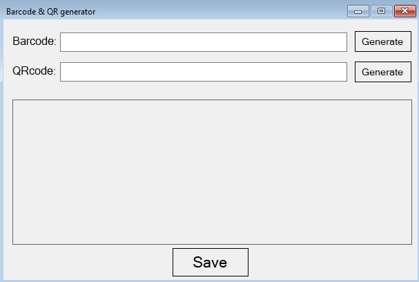

# C#-Projects

### Barcode and QR code generator
This is a program to generate code 128 and QR codes. 

- Enter the material ID/part number/ etc. in the Barcode or QRcode section and hit Generate.
- Code will be generated and the user can hit save to be saved in their desktop.

### Purpose
This simple appliation to help generate code 128 and QR codes formats on the fly, rather than going to third party websites and 'waste' time there.

### Here are snapshots of the logging in as Testeng:

- 
